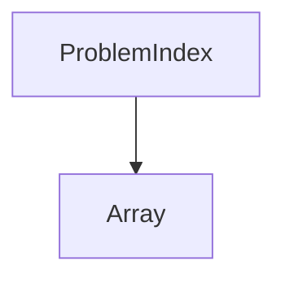

## 1. Stack
- Language observed in code: C++ — 10 `.cpp` files under `Greeks For Greeks/Array/`
- README.md states "Programming Languaage: Python" (README.md line 6) — does not match the actual `.cpp` files found; no Python files exist in the repo
- No package manifest present (no package.json / go.mod / pyproject.toml / Cargo.toml) — this is an informal script collection, not a built package
- `.vscode/c_cpp_properties.json` and `.vscode/tasks.json` are present (C/C++ extension project files); contents not read — out of scope

## 2. Directory map
| path | what lives there |
|---|---|
| `Greeks For Greeks/` | Root folder for algorithm solutions, meant to be organized by problem category |
| `Greeks For Greeks/Array/` | 10 `.cpp` files solving array-pattern problems (e.g. Kadane's Algorithm, Boyer-Moore Voting, Rotate An array, Second Largest) |
| `README.md` | Markdown table indexing 77 planned DSA problems (video link, category, name, LeetCode link, approach notes) |
| `.vscode/` | Editor project config (C/C++ IntelliSense + task settings); not read, out of scope |

## 3. Diagram

## 4. Component index
- [[ProblemIndex]]
- [[Array]]

## 5. Entry points
- No runnable application entry point exists — no `main.*` / `index.*` / `app.*` at repo root, `src/`, or `app/` (checked, none found)
- Dev: each `.cpp` file in `Greeks For Greeks/Array/` is a standalone problem solution, compiled/run individually (e.g. `Greeks For Greeks/Array/Kadane's Algorithm.cpp`) — no build script found
- Prod: none — this is a reference/practice repo of DSA solutions, not a deployable application

## 6. Conventions
- Solution files are named after the algorithm/problem in Title Case with spaces, `.cpp` extension (e.g. `Second Largest.cpp`, `Stock Buy and Sell.cpp`, `Boyer-MooreVoting Algorithm.cpp`) — observed in `Greeks For Greeks/Array/`
- Solutions are grouped one folder per DSA category under `Greeks For Greeks/` (only `Array` is populated so far)
- `README.md` uses a single markdown table (columns: `# | Video Solution | Category | Name | Link | Notes`) as the master problem index (source: README.md)

## 7. Where things go
- Add a new Array problem: create a new `.cpp` file in `Greeks For Greeks/Array/`, named after the problem in Title Case
- Add a new category (e.g. Binary, Tree, Graph — listed in README.md but not yet present as folders): create `Greeks For Greeks/<Category>/` and add `.cpp` files there
- Record a solved/new problem in the index: add a row to the table in `README.md`
- TODO: verify whether any build/run command exists — no manifest or Makefile was found within the read scope
